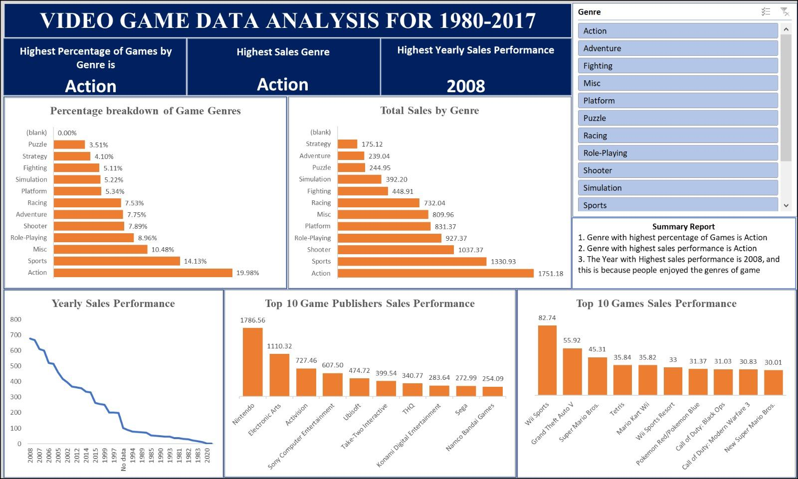

# **Video Game Data Analysis (1980–2017)**  

---

## **Table of Contents**  
1. [Project Overview](#project-overview)  
2. [Tools Used](#tools-used)  
3. [Project Steps](#project-steps)  
4. [Features](#features)  
5. [Dashboard Insights](#dashboard-insights)  
6. [Key Takeaways](#key-takeaways)  

---

## **Project Overview**  
The *Video Game Data Analysis* project provides an in-depth look at the gaming industry's performance over the years. Built entirely in **Microsoft Excel**, the interactive dashboard helps users visualize:  
- Popular game genres  
- Top-performing years for sales  
- Leading game publishers  
- Best-selling video games  

---

## **Tools Used**  
- **Microsoft Excel**  
   - Data Cleaning  
   - Custom Columns  
   - Pivot Tables  
   - Charts & Slicers (Filters)  
   - Dashboard Design  

---

## **Project Steps**  
The following steps were taken to build the dashboard:  
1. **Data Collection:**  
   - Raw data on video game sales (1980–2017) was obtained.  

2. **Data Cleaning:**  
   - Replaced empty or missing rows with `Null` values.  
   - Removed inconsistencies to prepare data for analysis.  

3. **Custom Calculations:**  
   - Added new columns to derive meaningful metrics.  

4. **Pivot Tables & Connections:**  
   - Created pivot tables for dynamic grouping and calculations.  
   - Connected these tables to charts for interactivity.  

5. **Dashboard Design:**  
   - Added slicers for filters (genres, publishers, years).  
   - Used bar charts, line graphs, and custom formatting for better visuals.  

---

## **Features**  
- **Interactive Dashboard:** Users can filter data by genre, year, or publisher.  
- **Dynamic Visuals:**  
   - Bar charts for sales by genre and publishers.  
   - Line chart for yearly performance.  
- **Custom Metrics:** Calculated insights like top genres, publishers, and peak sales years.  

---

## **Dashboard Insights**  

1. **Top Game Genre:**  
   - *Action* games dominate with **19.98%** of all games and the highest sales.  

2. **Best Year for Sales:**  
   - **2008** marked the peak sales year, reflecting strong industry performance.  

3. **Top Publisher:**  
   - *Nintendo* led with **1786.56 million units sold**.  

4. **Top-Selling Game:**  
   - *Wii Sports* recorded the highest sales at **82.74 million units**.  

---

## **Key Takeaways**  
- Excel can be a powerful tool for data analysis and dashboard design.  
- Action games consistently lead the market, while 2008 was the golden year for video game sales.  
- Publishers like *Nintendo* and *Electronic Arts* dominate the industry.  

